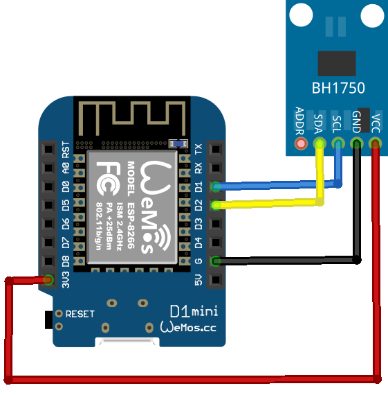

| Repository Status | myESPhome Repo |
| :--- | :--- |
|  [![last commit time][github-last-commit]][github-master] [![GitHub Activity][commits-shield]][commits] |   |
| [![License][license-shield]](LICENSE) [![Forks][forks-shield]][forks-url] [![Stargazers][stars-shield]][stars-url] [![Issues][issues-shield]][issues-url] | [![Contributors][contributors-shield]][contributors-url]  |

|  myESPhome |
| :--- |
|   |

# myESPhome Projects

<!-- @import "[TOC]" {cmd="toc" depthFrom=1 depthTo=6 orderedList=false} -->

## Intro

Wat is myESPhome.

### a list of all devices in this project

* Luxmeter (operational)
* Garagedoor Opener (comming soon)
* Ikea Air Quality Meter (comming soon)

### Luxmeter

#### Partlist

| Description | Link Aliexpress | Link Amazon |
| :--- | :--- | :--- |
| WMOS D1 | | |
| BH1780 sensor | | |

#### Pinout

## Support

Je kan op verschillende manieren contact met me zoeken.

### Github

Maak een "issue" aan. Ik zal zo snel mogelijk regageren

### Discord

Ik ben een actieve member van de Huizebruin Discord groep. Mocht je vragen hebben kun je altijd lid worden van dit kanaal en contact met me zoeken. (schmm)
En natuurlijk ook in contact komen met meerdere HomeAssistant gebruikers!

[![Discord][discord-shield]][discord]

### E-mail

Je kan me ook altijd een mailtje sturen. dit kan naar myesphome@[nogtebepalen].nl. Ik zal hier zo snel mogelijk op reageren. Ik zal altijd proberen te reageren binnen 2 werkdagen.

[commits-shield]: https://img.shields.io/github/commit-activity/m/scns/myESPhome.svg
[discord]: https://discord.gg/bN8rC7gEng
[discord-shield]: https://img.shields.io/discord/723629686093119650.svg?logo=discord&color=7289da
[commits]: https://github.com/scns/myESPhome/commits/main
[github-last-commit]: https://img.shields.io/github/last-commit/scns/myESPhome.svg?style=plasticr
[github-master]: https://github.com/scns/myESPhome/commits/main
[license-shield]: https://img.shields.io/github/license/scns/myESPhome.svg
[contributors-url]: https://github.com/scns/myESPhome/graphs/contributors
[contributors-shield]: https://img.shields.io/github/contributors/scns/myESPhome.svg
[forks-shield]: https://img.shields.io/github/forks/scns/myESPhome.svg
[forks-url]: https://github.com/scns/myESPhome/network/members
[stars-shield]: https://img.shields.io/github/stars/scns/myESPhome.svg
[stars-url]: https://github.com/scns/myESPhome/stargazers
[issues-shield]: https://img.shields.io/github/issues/scns/myESPhome.svg
[issues-url]: https://github.com/scns/myESPhome/issues
