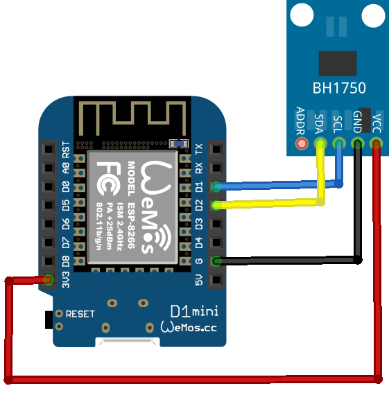

# MyESPHome

ESPHome configurations for Home Assistant, with a static website for initial USB
installation through ESP Web Tools.

Website: [myesphome.assistantathome.nl](https://myesphome.assistantathome.nl/).

The responsive website includes a filterable project collection, a board-specific
web installer, setup instructions, FAQs, parts and printable cases, and contact
information. It uses plain HTML, CSS and JavaScript in `static/`; no frontend build
or npm installation is required. All internal paths are relative, so the site also
works under a GitHub Pages repository path.

## Device status

| Device | Status | Target hardware |
| --- | --- | --- |
| Luxmeter | Supported; web installation | WEMOS D1 Mini / ESP8266 and BH1750 |
| IKEA Vindriktning | Supported; web installation | WEMOS D1 Mini / ESP8266 and PM1006 |
| Bluetooth proxy | Supported; web installation | ESP32-C3 DevKitM-1, 4 MB flash |
| Garage door | Experimental; personal installation only | WEMOS D1 Mini / ESP8266, relay and two endstops |
| DS18B20, DS18B20 beta, DHT22, FORNUFTIG, UPPATVIND, KEMO M152 | Concept; not published | Pinouts and device implementations still required |

The source of truth is [static/devices.json](static/devices.json). A working
configuration is not automatically proof of hardware compatibility. Bluetooth
proxy firmware in this repository targets **ESP32-C3**, not arbitrary ESP32 boards.
ESP32-S2 has no Bluetooth support.

## Initial web installation

1. Open the website over HTTPS in desktop Chrome or Edge with WebSerial support.
2. Select the device and check the **Required board** label.
3. Connect the matching board with a USB data cable and install the firmware.
4. Configure Wi-Fi through Improv Serial or the fallback access point.
5. Complete the secured setup below before normal use.

The installer checks the selected manifest before enabling installation. Only
supported devices are offered. The site and its firmware are published together.
The source `static/` directory alone does not contain firmware, so a local preview
will show unavailable firmware until publication artifacts are present.

## Secure device setup

Public firmware is bootstrap firmware: it cannot contain your personal device
key. The API initially permits local setup. There is no public web server or
unauthenticated ESPHome OTA listener. ESP8266 public firmware has no HTTP firmware
updates because its HTTP Request component cannot verify TLS certificates. The
ESP32-C3 public update path uses certificate verification.

For permanent use, generate your own configuration with a unique API key,
encrypted OTA and a protected fallback access point:

```sh
python -m pip install -r requirements-dev.txt
python scripts/secure_setup.py luxmeter --name living-room-luxmeter
```

Edit `esphome/private/living-room-luxmeter/secrets.yaml` with your Wi-Fi details,
then use a **USB** connection for the first secured installation:

```sh
python -m esphome run esphome/private/living-room-luxmeter/device.yaml
```

Select the serial port when prompted. For a Bluetooth proxy, substitute
`bluetoothproxy`; for a garage door, substitute `garagedoor`. Never install a
concept configuration as a working device.

Both generated files are ignored by Git. The script refuses to overwrite an
existing device and never prints credentials. Store your secrets securely. Add
the device to Home Assistant using its personal API key. Later updates use the
same private configuration and encrypted ESPHome OTA. Public HTTP updates are
removed from private configurations so they cannot replace your personal keys
with bootstrap firmware. The generator disables dashboard import in the private
configuration for the same reason.

If you already have an adopted device, preserve its working keys and passwords.
Do not replace them with freshly generated keys during an OTA migration. Review
the [ESPHome OTA migration instructions](https://esphome.io/components/ota/esphome/)
or use USB for the new secured configuration.

The device web server is disabled. If you explicitly need one, enable it only in
your private configuration with `web_server.auth` and a unique password stored in
`secrets.yaml`; keep it off the public internet.

## Hardware

### Luxmeter

| BH1750 | WEMOS D1 Mini |
| --- | --- |
| VCC | 3.3 V |
| GND | GND |
| SCL | D1 / GPIO5 |
| SDA | D2 / GPIO4 |

The sensor address is `0x23`; readings are taken every 30 seconds. The sensor is
BH1750, not BH1780.



### Vindriktning

The PM1006 sensor sends serial data to D2 at 9600 baud. Follow the actual device
wiring and share ground. Its PM2.5 reading is a concentration measurement, not a
calculated air quality index.

### Garage door

Read [commissioning and limitations](docs/maintenance.md#garage-door-commissioning)
before installation. The relay starts off, the virtual lock starts on, both
endstops are filtered and travel timers are cancelled when motion stops or an
endstop is reached. Contradictory endstops prevent commands. Hardware verification
is required, including D3/GPIO0 boot behavior and the physical door controller.

## Development and publication

Python 3.12 and Node.js are required for local checks:

```sh
python -m pip install -r requirements-dev.txt
python scripts/project.py check
python -m unittest discover -s tests
node --test tests/installer.test.cjs
python scripts/project.py validate
```

**Pushes and pull requests validate only; they do not build firmware files.**
Publishing a GitHub release or manually running **Publish website and firmware**
builds all supported devices and deploys the complete website. A missing artifact,
wrong chip family, unsafe binary path or OTA checksum mismatch blocks deployment.
Release dashboard imports are pinned to the exact build commit.

See [maintenance instructions](docs/maintenance.md) for version updates, new
devices, GitHub Pages setup and release behavior. See [Docker instructions](.docker/readme.md)
for a lightweight local website preview and ESPHome containers.

## Troubleshooting

* Use desktop Chrome or Edge, HTTPS (or localhost) and a USB data cable.
* If the board is not detected, check its USB driver and boot/download mode.
* If installation firmware is unavailable, wait for a successful website publication.
* If Home Assistant cannot find the device, check Wi-Fi, network reachability,
  mDNS and the encryption key used by your private configuration.
* If a secured OTA update fails, use the existing device key; key changes require
  the appropriate ESPHome migration procedure or a USB flash.

## Contributing and support

Please read [CONTRIBUTING.md](CONTRIBUTING.md). Report problems through
[GitHub issues](https://github.com/scns/myESPhome/issues), including the board,
configuration revision, ESPHome version and logs with credentials removed.

[ESPHome documentation](https://esphome.io) ·
[ESP Web Tools](https://esphome.github.io/esp-web-tools/) ·
[Home Assistant](https://www.home-assistant.io/)

Licensed under the [MIT License](LICENSE).
